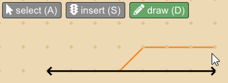
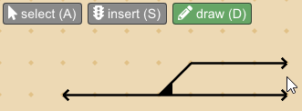
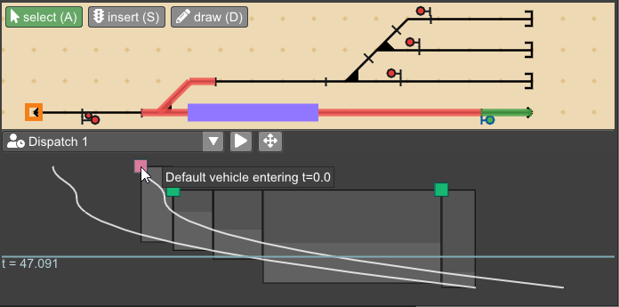
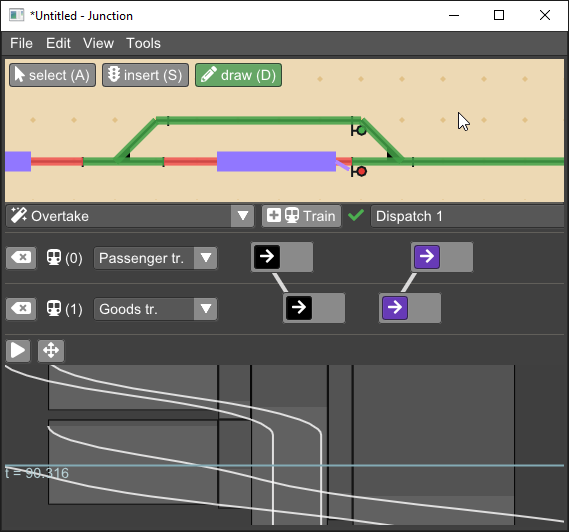

* [Download / 다운로드 (Win/Linux/MacOS)](https://github.com/luteberget/junction/releases/latest)
* [Repository / 저장소](http://github.com/luteberget/junction/)

Junction은 건설 프로젝트 등 소규모 인프라를 위한 철도 운용 분석 도구다.  
선로와 신호 설비 **infrastructure / 인프라** 모델을 빠르게 구축하거나 가져온 뒤,  
열차를 **dispatch / 운행 지령** 해 선로 구성과 신호 장치의 용량 특성을 살펴볼 수 있다.  
여러 운행 시나리오를 관리하면서 인프라를 수정할 때마다 각 시나리오의  
타임라인이 어떻게 변하는지 확인할 수 있다.  
또한 고수준 운용 설명만 입력하면 필요한 지령을 자동으로 계산해 주는  
**auto-dispatch / 자동 운행 지령** 모드를 제공해, 프로젝트 진행 중 변경이 생겨도  
신호 설계 검증용 테스트 케이스를 지속적으로 확보할 수 있다.

## Quick tour / 빠른 둘러보기

* 그리드 위에 선을 그리기만 하면 선로와 신호 설비 **infrastructure / 인프라** 를 빠르게 구축할 수 있다.  
  선로 분기와 교차점은 선을 기반으로 자동 인식·표시된다.  

  자세한 내용은 [Infrastructure / 인프라](infrastructure.md)를 참고.

   

* 열차 경로의 시작 위치를 지정하고 메뉴에서 경로를 선택해 개별 열차를 **Dispatch / 운행 지령** 할 수 있다.  

  자세한 내용은 [Dispatching / 운행 지령](dispatch.md)를 참고.

  

* 교행, 추월, 열차 빈도 등 다양한 운용을 나타내는 **plans / 계획** 을 작성해  
  이를 만족하는 운행 패턴 목록을 확인할 수 있다.  
  인프라를 수정하면 계획도 자동 갱신돼 운용 가능 여부를 한눈에 확인할 수 있다.  

  자세한 내용은 [Planning / 계획](planning.md)를 참고.

  
