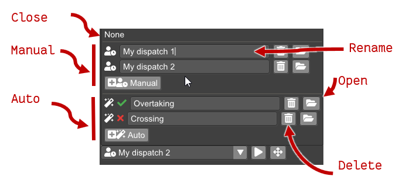
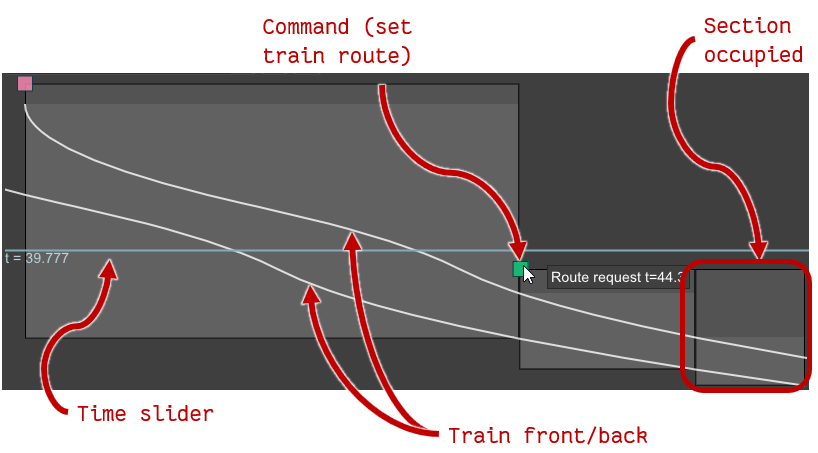

인프라 뷰(**Infrastructure view / 인프라 뷰**)에서 열차 디스패치(**dispatching / 디스패칭**)을 시작하는 방법은 다음 두 가지입니다.

1. 경계 노드(**boundary node / 경계 노드**)를 우클릭하여 해당 지점에서 열차를 출발시킵니다.  
   디스패치 선택 메뉴에 현재 선택된 디스패치가 없다면 새 디스패치가 만들어집니다.
2. 디스패치 선택 메뉴를 열어 새 디스패치를 추가합니다.

디스패치 선택 메뉴(**dispatch selection menu / 디스패치 선택 메뉴**)는  
디스패치 뷰를 열고 닫거나, 다른 디스패치로 전환하거나, 디스패치를 추가·삭제·이름 변경할 때 사용합니다.

## Dispatch selection / 디스패치 선택

디스패치 선택 메뉴는 항상 인프라 뷰 하단에 위치합니다.

디스패치 선택 메뉴에는 디스패치 **modes / 모드**가 표시됩니다.

* **None / 없음**: 디스패치 뷰를 닫고 인프라만 표시합니다.
* **Manual dispatches / 수동 디스패치**: 사용자가 명령을 추가·삭제할 수 있는 디스패치.  

  명령(**commands / 명령**)의 종류:  
  * **Trains / 열차**: 지정된 차량 유형의 열차가 특정 경계 노드 경로를 통해 모델에 등장합니다.  
  * **Route / 경로**: 열차 경로가 활성화됩니다.

* **Auto dispatch / 자동 디스패치**: 열차 이동 제약 조건을 주면  
  현재 인프라에서 가능한 디스패치 목록을 제시합니다.  
  자세한 내용은 [Planning](planning.md)을 참고하세요.

디스패치 선택 메뉴에는 각 모드별 새 디스패치 추가, 이름 변경, 삭제, 열기 버튼이 있습니다.  
디스패치를 열면 디스패치 다이어그램과(자동 디스패치의 경우) 플래닝 뷰가 함께 열립니다.  
자동 디스패치의 아이콘에는 현재 인프라에서 제약 조건이 충족되는지 여부가 표시됩니다.

## Dispatch diagram view / 디스패치 다이어그램 뷰

디스패치 선택 메뉴에서 디스패치를 열면 창 하단에 다이어그램이 표시됩니다.  
다이어그램은 세로축이 **time / 시간**, 가로축이 **distance (mileage) / 거리(마일리지)**인 시간–거리 그래프입니다.  
다이어그램에는 다음 요소가 포함됩니다.

* **Squares / 사각형**—디스패치의 명령을 나타냅니다.  
  명령을 우클릭하면 삭제할 수 있는 컨텍스트 메뉴가 열리고,  
  좌클릭 후 드래그하면 명령 실행 시간을 조정할 수 있습니다.

* **Boxes / 상자**—각 구간의 열차 점유(검지) 상태를 나타냅니다.

* **Curves / 곡선**—각 열차 전-후방 위치를 나타냅니다.

### Interaction in the dispatch view / 디스패치 뷰 상호작용

다이어그램 뷰를 좌클릭하면 커서의 세로 위치에 해당하는 시각으로 **time slider / 시간 슬라이더**가 이동합니다.

현재 열린 디스패치가 **manual dispatch / 수동 디스패치**라면 편집이 가능합니다.

새 명령은 인프라 컨텍스트 메뉴(참고: [Infrastructure](infrastructure.md))에서  
디스패치로 추가할 수 있습니다.
