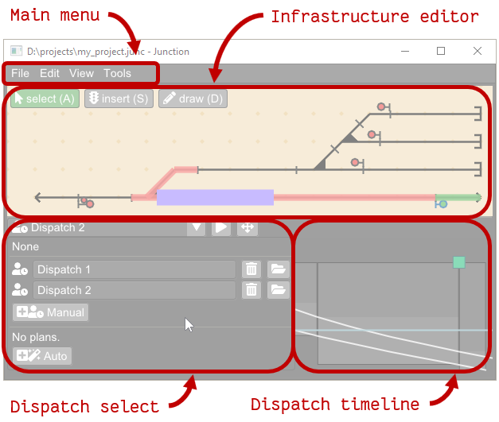

---

title: Getting started / 시작하기
nav\_order: 2
-------------

## Installing / 설치

Junction은 아래 링크에서 바이너리 실행 파일을 다운로드하여 설치할 수 있습니다:

* [github.com/luteberget/junction/releases/latest](https://github.com/luteberget/junction/releases/latest)

설치 프로그램은 없으며 단일 실행 파일만 제공되므로 원하는 위치에 두고 실행하면 됩니다.

## Building from source / 소스에서 빌드

프로그램을 수정하거나 소스에서 빌드하려면 GitHub 저장소에서 소스 코드를 다운로드할 수 있습니다:
[github.com/luteberget/junction](https://github.com/luteberget/junction).
프로젝트를 빌드하려면 시스템에 Rust 컴파일러 툴체인과 C++ 컴파일러 툴체인이 설치되어 있어야 합니다.

## Usage / 사용 방법

메인 창은 다음 구성 요소로 이루어져 있습니다:

* The **main menu bar / 메인 메뉴 바** (see [Main menu / 메인 메뉴](#mainmenu)).
* The **infrastructure editor / 인프라 편집기** (see [Infrastructure / 인프라](infrastructure.md)).
* The **dispatch selection menu / 운행 지령 선택 메뉴** (see [Dispatch / 운행 지령](dispatch.md)).
* The **dispatch output diagram / 운행 지령 결과 다이어그램** (see [Dispatch / 운행 지령](dispatch.md)).

## Main menu / 메인 메뉴

메인 메뉴에서는 문서를 불러오고, 저장하고, 가져오고, 내보낼 수 있으며
다음 도구 창을 열 수 있습니다:

* **File / 파일**

  * railML 파일 **import/export / 가져오기·내보내기**.
* **Edit / 편집**

  * **Edit vehicles / 차량 편집** (see [Vehicles / 차량](vehicles.md)).
  * **Signal designer / 신호 디자이너** (see [Signal designer / 신호 디자이너](signaldesigner.md)).
* **View / 보기**

  * **Log view / 로그 뷰** (see [Log / 로그](log.md)).
  * **Model inspector / 모델 인스펙터** (see [Model inspector / 모델 인스펙터](modelinspector.md)).
  * **Configure settings / 설정 구성** (see [Settings / 설정](settings.md)).
