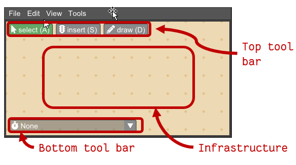
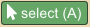
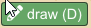
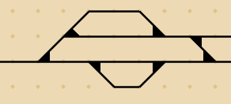
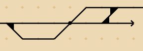
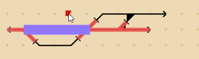

Junction 메인 창의 상단에는 선로, 트랙 노드, 신호 객체로 구성된 **Infrastructure / 인프라**가 표시됩니다.  
Junction을 처음 실행하거나 새 문서를 만들면 인프라가 비어 있어 빈 캔버스와 각 편집 도구 버튼만 보입니다.

### Top tool bar / 상단 툴바

상단 툴바에는 다음과 같은 도구가 있습니다.

*  **Select items / 항목 선택** (단축키 ‘A’)  
  트랙·노드·객체를 왼쪽 클릭하여 선택합니다. 선택된 항목은 색으로 하이라이트됩니다.  
  Shift를 누르면 선택이 추가되고, 클릭-드래그로 선택 창을 그리면 창 내부의 항목들이 한 번에 선택됩니다.  
  항목 위에서 드래그하면 해당 항목(또는 현재 선택된 모든 항목)이 이동합니다.

*  **Insert object / 객체 삽입** (단축키 ‘S’)  
  삽입 가능한 철도 신호 객체:  
  - Main signal / 본신호 (distant signal 포함 또는 미포함)  
  - Detector / 검지기 (열차 점유 검지 구간 경계)  

  본신호는 트랙 옆을 클릭해 배치하며, 배치 위치(트랙의 왼/오른쪽)가 신호가 바라보는 진행 방향을 결정합니다.  
  검지기는 트랙 중앙에 배치되어 검지 구간의 경계를 형성합니다.

*  **Draw tracks / 트랙 그리기** (단축키 ‘D’)  
  클릭-드래그로 인프라 그리드에 트랙을 그립니다.  
  하나의 그리드 점에서 3줄이 만나면 **switch / 분기기**, 4줄이 만나면 **crossing / 교차** 노드가 자동으로 생성됩니다. 예시:  
   

### Bottom tool bar / 하단 툴바

하단 툴바에는 접힌 형태의 **Dispatch select menu / 디스패치 선택 메뉴**가 있습니다. 클릭하면 메뉴가 펼쳐집니다. (자세한 내용은 [Dispatch](dispatch.md) 참고)

디스패치를 열면 다이어그램 보기에서 선택된 시점의 인프라 상태(열차 위치, 검지 구간 상태 등)가 인프라 뷰 위에 오버레이됩니다.  
이 그래픽은 단지 표시용이며 편집에는 영향을 주지 않으므로, 상태가 표시된 채로도 인프라를 자유롭게 수정할 수 있습니다.

### Context menu / 컨텍스트 메뉴

인프라 뷰에서 마우스 오른쪽 버튼을 클릭하면 **context menu / 컨텍스트 메뉴**가 열립니다.  
포인터가 항목 위에 있으면 먼저 해당 항목이 선택된 뒤 메뉴가 표시됩니다.

* **Delete / 삭제** — 모든 항목에서 사용 가능.  
  노드를 삭제할 때는 기본 자동 감지된 노드 형태는 남고, 변경된 속성만 제거됩니다.

* **Node/Object properties / 노드·객체 속성** — 선택한 유형에 맞는 속성이 표시됩니다.  
  예) Crossing / 교차 노드:  
  (a) Crossover / 교차로 (전환 없음)  
  (b) Single slip / 싱글 슬립 (단방향 전환)  
  (c) Double slip / 더블 슬립 (양방향 전환)  
  Main signal / 본신호: distant signal 사용 여부 등

* **Train route / 열차 경로 추가** — Boundary node 및 Main signal에서 가능.  
  클릭하면 현재 활성 디스패치의 현재 시점에 경로가 추가됩니다.  
  활성 디스패치가 없으면 새 디스패치를 생성·열어 경로를 추가합니다. (자세한 내용은 [Dispatch](dispatch.md) 참고)

* **Add visit location / 방문 위치 추가** — 모든 항목에서 가능.  
  현재 활성 **plan / 계획**에 선택 항목을 방문 위치로 추가합니다.  
  활성 계획이 없으면 새 계획을 열고, 새 열차를 만든 뒤 방문 위치를 추가합니다. (자세한 내용은 [Planning](planning.md) 참고)
