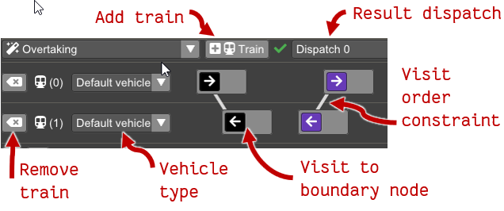

디스패치 선택 메뉴(참고: [Dispatch](dispatch.md))에서 **auto dispatch / 자동 디스패치**가 선택되면  
플래닝 메뉴(**planning menu / 플래닝 메뉴**)가 열립니다.

플래닝 뷰(**planning view / 플래닝 뷰**)에서는 플랜을 편집하고,  
제약 조건을 만족하는 모든 대체 디스패치(결과)를 확인할 수 있습니다.

 * **Add trains / 열차 추가** 버튼은 플래닝 영역 맨 아래에 새 행을 추가하여  
   방문 위치가 아직 없는 새 열차를 만듭니다.  
   방문 위치(**visit / 방문 위치**)는 인프라 뷰에서 우클릭 후  
   컨텍스트 메뉴로 해당 지점을 열차에 추가할 수 있습니다.

 * **Result dispatch / 결과 디스패치** 메뉴는 디스패치가  
   성공적으로 생성되었는지(초록 체크), 실패했는지(빨간 X)를 표시합니다.  
   메뉴에서 디스패치를 선택하면 다이어그램 뷰가 열리며,  
   수동 디스패치 다이어그램과 동일하게 동작하지만  
   명령은 편집할 수 없습니다.

 * **Trains / 열차**는 플래닝 뷰에서 각 행에 하나씩 표시됩니다.  
   열차는 삭제할 수 있고, 차량 유형을 설정할 수 있습니다.  
   방문 위치는 인프라 뷰 우클릭 → 컨텍스트 메뉴로 추가합니다.

   방문 위치는 다음과 같이 사용됩니다.

   * 각 방문 위치는 열차 행에 **box / 상자**로 표시됩니다.  
     열차는 각 방문 위치마다 지정된 여러 장소 중 하나 이상을 반드시 방문해야 합니다.
   * 방문 위치를 좌클릭 후 드래그하여 같은 열차 내 또는 다른 열차 사이에서  
     순서를 바꿀 수 있습니다.  
     한 방문 위치를 다른 방문 위치 위로 드래그하면 두 위치가 병합되어  
     합쳐진 방문 위치 중 최소 하나를 방문해야 합니다.
   * 방문 위치나 안의 개별 위치 위에 마우스를 올리면  
     인프라 뷰에서 해당 지점이 하이라이트됩니다.
   * 위치를 우클릭하면 방문, 위치, 제약 조건을 삭제할 수 있는  
     컨텍스트 메뉴가 나타납니다.
   * 컨텍스트 메뉴에서 새 **constraint / 제약 조건**을 추가할 수도 있습니다.  
     메뉴를 클릭하면 클릭한 방문 위치와 마우스 포인터 사이에 선이 표시됩니다.  
     다른 방문 위치를 클릭하면 “첫 번째 방문 → 두 번째 방문 이전” 관계의  
     제약 조건이 추가됩니다. 모든 제약 조건은 방문 위치 사이의 선으로 나타납니다.
