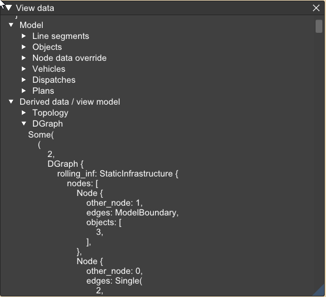

---

title: Model inspector / 모델 인스펙터
parent: Tool windows / 툴 윈도우
nav\_order: 5
-------------

**Model inspector / 모델 인스펙터** 창은 편집 중인 **analysis model / 분석 모델** 을 트리 구조로 보여주고,
운행 지령(시뮬레이션)에 사용되는 모델의 파생 정보를 함께 제공합니다.

모델 본체는 다음 요소로 구성됩니다:

* **Line segments / 선로 구간** — 선로를 나타내는 선분
* **Node properties / 노드 속성** — 기본값을 재정의하는 값들
* **Objects locations and functions / 객체 위치와 기능** (본신호기, 검지기 등)
* **Vehicle type specifications / 차량 종류 정의**
* **Dispatch specifications / 운행 지령 정의**
* **Plan specifications / 계획 정의**

분석 출력은 다음을 포함합니다:

* **Topology / 토폴로지** — 선분으로부터 추론된 선로·노드 타입
* **DGraph / 이중 노드 그래프** — 시뮬레이션에 사용되는 철도 네트워크 그래프
* **Interlocking / 인터로킹** — 연속된 본신호기 사이를 잇는 **elementary routes / 기본 경로** 및 열차가 통과해야 하는 검지 구간
* **Dispatches / 운행 결과** — 각 수동 운행 지령마다 하나의 시뮬레이션 결과를 제공하며,
  이는 운행 다이어그램 뷰에 사용되는 타임라인을 포함합니다.
  각 **plan specification / 계획 지령**(자동 운행)마다 (비어 있을 수 있는) 시뮬레이션 결과 집합이 존재합니다.

