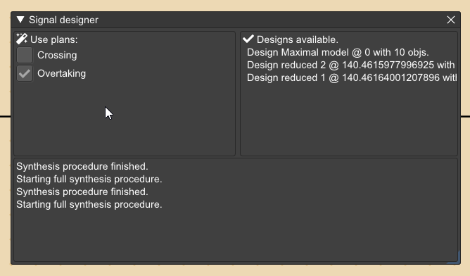

**Signal designer / 신호 설계 도구**는 신호기가 없는 선로만 포함된 인프라와
자동 운행 지령(auto-dispatch) 사양 세트를 기반으로 **신호 설계(synthesis)** 를 생성하는 데 사용됩니다
(자세한 내용은 [Dispatch / 운행 지령](dispatch.md) 참조).

신호 설계의 기반이 되는 자동 운행 지령 목록은 창의 왼쪽 부분에 표시되며,
원하지 않는 자동 운행 계획은 비활성화할 수 있습니다.

창의 오른쪽 부분에는 신호 설계 절차를 통해 생성된 설계들과 그 **점수(score)** 가 표시됩니다.
목록에서 설계를 선택하면 현재 인프라에 해당 설계를 추가할 수 있습니다.

