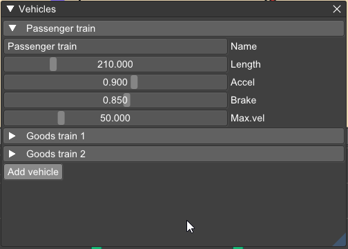

운행 지령(dispatch) 및 계획(planning)에 사용되는 **차량(Vehicles)** 은 다음과 같은 특성으로 정의됩니다:

* 이름 (Name)
* 길이 (Length)
* 최고 속도 (Maximum velocity)
* 최대 가속도 (Maximum acceleration)
* 최대 제동 감속도 (Maximum braking de-acceleration)

