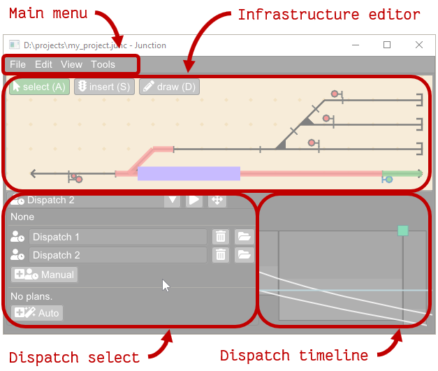

## Installing

You can install Junction by downloading a binary executable from here:

 * [github.com/luteberget/junction/releases/latest](https://github.com/luteberget/junction/releases/latest)

There is no installation program, only a single executable that you can put wherever you want.

## Building from source

If you would like to build Junction from source or modify the program, the source code can be downloaded
from the Github repository at [github.com/luteberget/junction](https://github.com/luteberget/junction).
Building the project depends on the Rust compiler toolchain and a C++ compiler toolchain being installed
on your system.

## Usage

The main window consists of the following components:

* The main menu bar (see [Main menu](#mainmenu)).
* The infrastructure editor (see [Infrastructure](infrastructure.md)).
* The dispatch selection menu (see [Dispatch](dispatch.md)).
* The dispatch output diagram (see [Dispatch](dispatch.md)).

## Main menu

The main menu let you load, save, import, and export documents, and 
lets you open the following tool windows:

 * File
    * Import/export railML files.
 * Edit
    * Edit vehicles (see [Vehicles](vehicles.md)).
    * Signal designer (see [Signal designer](signaldesigner.md)).
 * View
    * Log view (see [Log](log.md)).
    * Model inspector (see [Model inspector](modelinspector.md)).
    * Configure settings (see [Settings](settings.md)).

