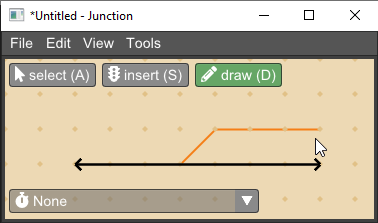
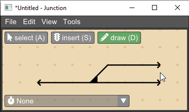
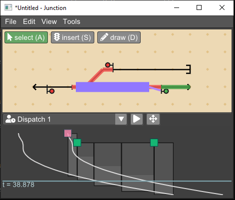
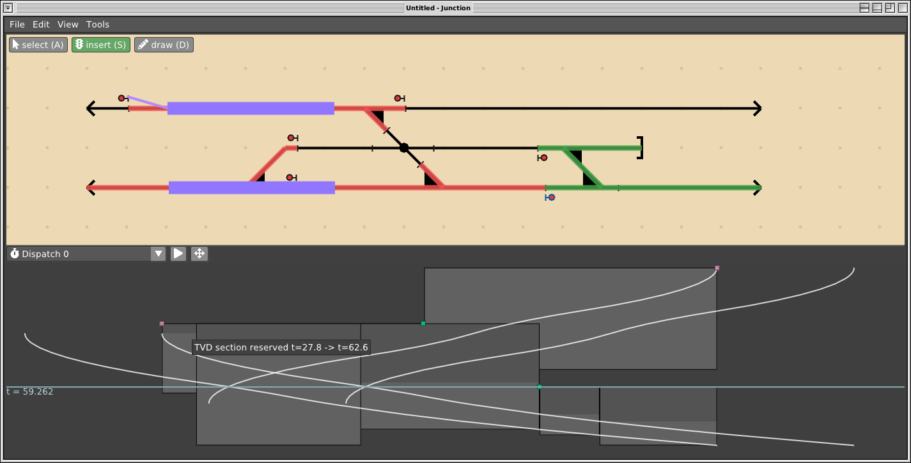

[⇓ Download (win/linux/macos)](https://github.com/luteberget/junction/releases/latest){: .btn .btn-green } [Repository](http://github.com/luteberget/junction/){: .btn .btn-outline }

Junction is a railway operations analysis tool for small-scale infrastructure,
such as construction projects. Its main features are:

 * Quickly build the **infrastructure** of tracks and signaling equipment by 
   drawing lines on a grid. Switches and crossings geometry and topology
   are automatically inferred from the visual drawing.

    

   See [Infrastructure](infrastructure.md).

 * **Dispatch** individual trains using train routes by pointing to the starting location
   of a train route and selecting a route from the menu.

   

   See [Dispatching](dispatch.md).

 * Build **plans** representing train operations such as crossing, overtaking, train frequency, etc.,
   and get a list of possible dispatch patterns that solve.
   When you continue adjusting the infrastructure, the plans will be updated and
   you can check at a glance that operations are still working.

   

   See [Planning](planning.md).

